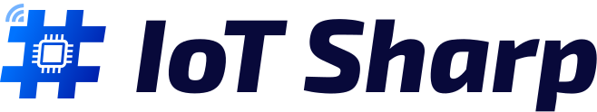

<p align="left">
  <a href="https://iotsharp.io/">
    
  </a>
</p>


#### 🌈 介绍

这是一个基于模板vue-next-admin 的 IoTSharp前端项目, IoTSharp 是一个 基于.Net Core 开源的物联网基础平台， 支持 HTTP、MQTT 、CoAp 协议， 属性数据和遥测数据协议简单类型丰富，简单设置即可将数据存储在PostgreSql、MySql、Oracle、SQLServer、Sqlite，是一个用于数据收集、处理、可视化与设备管理的 IoT 平台.

[](https://github.com/IoTSharp/ClientAppWithVue3/actions/workflows/nodejsbuild.yml) [](https://github.com/IoTSharp/ClientAppWithVue3/actions/workflows/submodule-update.yml)


#### ⛱️ 线上预览

- Demo <a href="http://demo.iotsharp.net" target="_blank">http://demo.iotsharp.net</a>
 

#### 💒 代码仓库

- vue3.x 版本 <a href="https://github.com/IoTSharp/ClientAppWithVue3" target="_blank">https://github.com/IoTSharp/ClientAppWithVue3</a>
 
#### 🚧 安装 npm

- 复制代码(桌面 cmd 运行) `npm install `


#### 🏭 环境支持

| Edge      | Firefox      | Chrome      | Safari      |
| --------- | ------------ | ----------- | ----------- |
| Edge ≥ 79 | Firefox ≥ 78 | Chrome ≥ 64 | Safari ≥ 12 |

> 由于 Vue3 不再支持 IE11，故而 ElementPlus 也不支持 IE11 及之前版本。

#### ⚡ 使用说明

建议使用  npm 

```bash
# 克隆项目
git clone https://github.com/IoTSharp/ClientAppWithVue3.git

# 进入项目
cd ClientAppWithVue3

# 安装依赖
npm install

# 运行项目
npm run dev

# 打包发布
npm run build
```

#### 💯 学习交流加
 
 点击这里查看详细连接 https://github.com/IoTSharp/IoTSharp#community-support


#### ❤️ 鸣谢列表

- <a href="https://github.com/lyt-Top/vue-next-admin" target="_blank">vue-next-admin</a>


 
