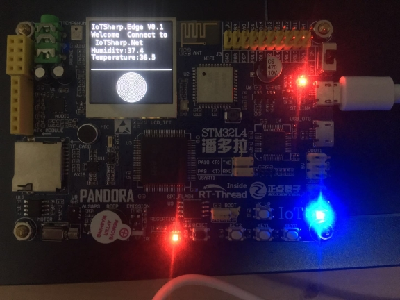
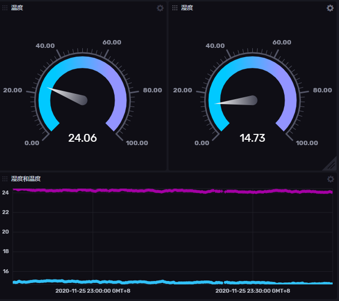

  

IoTSharp is an open-source IoT platform for data collection, processing, visualization, and device management.

## Here is a blessing for all users of this project
 * May you do good and not evil.
 * May you find forgiveness for yourself and forgive others.
 * May you share freely, never taking more than you give.

## How to  install  IoTSharp using docker-compose  ?

 * [ZPT](Deployments/zeromq_taos) Using ZeroMQ as EventBus, PostgreSQL as message storage, telemetry data stored through TDengine  

 * [ZPS](Deployments/zeromq_sharding) The default deployment configuration, IoTSharp and PostgreSql, telemetry data is stored through a single table or shading. 

 * [RMI](Deployments/rabbit_mongo_influx) Using Rabbitmq as EventBus, mongodb as message storage, telemetry data stored through influx  

 more [Deployments](https://github.com/IoTSharp/IoTSharp/tree/master/Deployments)

## What databases are supported?

 *  [PostgreSql](IoTSharp/appsettings.PostgreSql.json) The test environment is  PostgreSQL 11.3,Support for  sharding.
 *  [MySql](IoTSharp/appsettings.MySql.json) The test environment is MySQL 8.0.17,Support for  sharding.
 *  [Oracle](IoTSharp/appsettings.Oracle.json)  The test environment is  Oracle Standard Edition 12c Release 2 on CentOS , Support for  sharding.  See also: https://github.com/MaksymBilenko/docker-oracle-12c
 *  [SQLServer](IoTSharp/appsettings.SQLServer.json)  Microsoft SQL Server 2016 (RTM-GDR) (KB4019088) - 13.0.1742.0 (X64)   ,Support for  sharding
 *  [Sqlite](IoTSharp/appsettings.Sqlite.json) Support for  sharding

## Demo 
  http://139.9.232.10:2927

## How to install IoTSharp using docker ?

  -  docker pull iotsharp/iotsharp

## How to install  using Linux daemon ?

 -  mkdir  /var/lib/iotsharp/
 -	cp ./*  /var/lib/iotsharp/
 -	chmod 777 /var/lib/iotsharp/IoTSharp
 -	cp  iotsharp.service   /etc/systemd/system/iotsharp.service
 -	sudo systemctl enable  /etc/systemd/system/iotsharp.service 
 -	sudo systemctl start  iotsharp.service 
 -	sudo journalctl -fu  iotsharp.service 

## IoTSharp's Clients 
 - Cicada    A desktop application   

##  IoTSharp.SDKs

- IoTSharp.Sdk.Http   
- IoTSharp.Sdk.MQTT   

 

## IoTSharp-C-Client-Sdk

IoTSharp-C-client-Sdk is mqttt client, write by   c;

 https://github.com/IoTSharp/IoTSharp-C-Client-Sdk

## paho.mqtt.c's demo 

It' like IoTSharp-C-Client-Sdk, but is use paho.mqtt.c
 https://github.com/IoTSharp/IoTSharp.Edge.paho.mqtt.c

## IoTSharp.Edge.nanoFramework

IoTSharp.Edge.nanoFramework is a nanoFramework's mqtt client , it run on STM32 ！

  https://github.com/IoTSharp/IoTSharp.Edge.nanoFramework

more info read https://www.cnblogs.com/MysticBoy/p/13159648.html
or click  https://www.nanoframework.net/

##  IoTSharp.Edge.RT-Thread

IoTSharp.Edge.RT-Thread (STM32L4 + Wi-Fi, sensor, lcd, audio etc)

https://github.com/IoTSharp/IoTSharp.Edge.RT-Thread

  

 

 

IoTSharp's ecosystem

- MaiKeBing.CAP.ZeroMQ 
- MaiKeBing.CAP.LiteDB  
- MaiKeBing.HostedService.ZeroMQ  
- IoTSharp.X509Extensions  
- MQTTnet.AspNetCoreEx  
- Silkier     
- Silkier.EFCore   
- Silkier.AspNetCore  
- SilkierQuartz   
- Maikebing.EntityFrameworkCore.Taos   
- IoTSharp.Sdk.Http   
- IoTSharp.Sdk.MQTT   

## Support

| 公众号 |    [QQ群63631741](https://jq.qq.com/?_wv=1027&k=HJ7h3gbO)  |
| ------ | ---- |
|  |  |

## dotNET China

## Contributing

 - If you'd like to contribute to IoTSharp, please take a look at our [Contributing Guide](contributing.md).
 - If you have a question or have found a bug,[ file an issue.](https://github.com/IoTSharp/IoTSharp/issues)
 - To learn about project priorities as well as status and ship dates see the [IoTShap roadmap](roadmap.md).

