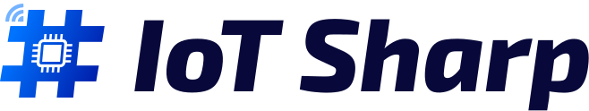

  

IoTSharp is an open-source industrial IoT platform for device access, telemetry collection, rule-chain processing, visualization, multi-tenant operations, and product delivery.

## Overview

IoTSharp brings together the core building blocks needed to run an IoT platform in production:

- Device and gateway connectivity with HTTP, MQTT, CoAP, and extensible protocol integration.
- Telemetry, attributes, alarms, products, assets, and tenant-aware management models.
- Rule-chain driven processing for transformation, notification, automation, and business actions.
- Relational and time-series storage options for different deployment and scaling needs.
- Multiple delivery modes including Docker, Windows service, Linux service, installer flows, and release artifacts.

The current main application targets `.NET 10`, and the web console is maintained as an IoTSharp-branded Vue 3 application.

## Quick Start

### Run IoTSharp locally

The recommended documentation entry points are:

- Product docs: <https://iotsharp.net/docs/intro>
- Installation options: <https://iotsharp.net/docs/getting-started/installation-options>
- Installer guide: <https://iotsharp.net/docs/getting-started/installer>
- Docker Desktop extension: <https://iotsharp.net/docs/deployment/docker-desktop-extension>

For frontend development, the current local dev server default is:

- Frontend: `http://localhost:27915`

### Use OpenClaw for AI-assisted SQLite setup

If you want OpenClaw to guide you through creating a local SQLite-based IoTSharp instance, start with:

- <https://iotsharp.net/docs/operations/openclaw-sqlite-runbook>
- Prompt template: [`tools/prompts/openclaw-sqlite-instance.txt`](tools/prompts/openclaw-sqlite-instance.txt)

The runbook defines the SQLite bootstrap flow, installer initialization path, Docker Desktop Extension fallback route, and the safe rule for switching databases later through `appsettings.{Environment}.Installer.json`.

## Supported Components

### Relational and operational databases

- PostgreSQL
- MySQL
- SQL Server
- Oracle
- SQLite
- Cassandra
- ClickHouse

Configuration templates are kept in the [`IoTSharp`](IoTSharp) project through `appsettings.*.json` files and related installer overlays.

### Time-series storage

- InfluxDB
- IoTDB
- TDengine
- TimescaleDB
- PinusDB
- Relational databases for simpler telemetry scenarios

### Event bus and message transport

- RabbitMQ
- Kafka
- InMemory
- ZeroMQ
- NATS
- Pulsar
- Redis Streams
- Amazon SQS
- Azure Service Bus

### Event bus state stores

- PostgreSQL
- MongoDB
- InMemory
- LiteDB
- MySQL
- SQL Server

## Deployment Options

- Docker: <https://iotsharp.net/docs/deployment/docker>
- Docker Desktop extension: <https://iotsharp.net/docs/deployment/docker-desktop-extension>
- Windows service: <https://iotsharp.net/docs/deployment/windows-service>
- Linux service: <https://iotsharp.net/docs/deployment/linux-service>
- Application configuration: <https://iotsharp.net/docs/configuration/appsettings>

Online demo:

- <https://host.iotsharp.net>

## Repository Structure

Key directories in this repository:

- [`IoTSharp`](IoTSharp): main ASP.NET Core application.
- [`ClientApp`](ClientApp): Vue 3 frontend console.
- [`docs`](docs): Docusaurus documentation site.
- [`docker-desktop-extension`](docker-desktop-extension): Docker Desktop extension experience package.
- [`IoTSharp.Installer.Windows`](IoTSharp.Installer.Windows): Windows installer project.
- [`IoTSharp.Agent`](IoTSharp.Agent): desktop tray agent project.
- [`IoTSharp.SDKs`](IoTSharp.SDKs): SDK and related client-facing artifacts.

## Ecosystem and Related Projects

NuGet packages and ecosystem libraries include:

- `IoTSharp.Sdk.Http`
- `IoTSharp.Sdk.MQTT`
- `IoTSharp.Extensions`
- `IoTSharp.Extensions.AspNetCore`
- `IoTSharp.Extensions.EFCore`
- `IoTSharp.Extensions.QuartzJobScheduler`
- `IoTSharp.HealthChecks.*`
- `IoTSharp.X509Extensions`

Related repositories:

- IoTSharp MQTT C SDK
- IoTSharp Edge paho.mqtt.c
- IoTSharp Edge nanoFramework
- IoTSharp RT-Thread package

## Documentation

- English docs entry: <https://iotsharp.net/docs/intro>
- Chinese README: [README.zh.md](README.zh.md)
- Roadmap: [roadmap.md](roadmap.md)
- Changelog: [CHANGELOG.md](CHANGELOG.md)

## Contributing

Contributions are welcome through issues and pull requests:

- Pull requests: <https://github.com/IoTSharp/IoTSharp/pulls>
- Issues: <https://github.com/IoTSharp/IoTSharp/issues>

Before contributing, please review the codebase structure, related documentation, and the current release/distribution direction in the docs site.

## Community Support

If you need help using or deploying IoTSharp, community channels are available in the docs and community materials:

- GitHub: <https://github.com/IoTSharp/IoTSharp>
- Gitee: <https://gitee.com/IoTSharp/IoTSharp>
- Official site: <https://iotsharp.net>

## Donation

IoTSharp is released under the Apache 2.0 license. If you would like to support the project, you can back it through:

- OpenCollective: <https://opencollective.com/IoTSharp>
- Afdian: <https://afdian.net/a/maikebing>
- Backers list: [BACKERS.md](BACKERS.md)

## Blessing

- May you do good and not evil.
- May you find forgiveness for yourself and forgive others.
- May you share freely, never taking more than you give.
