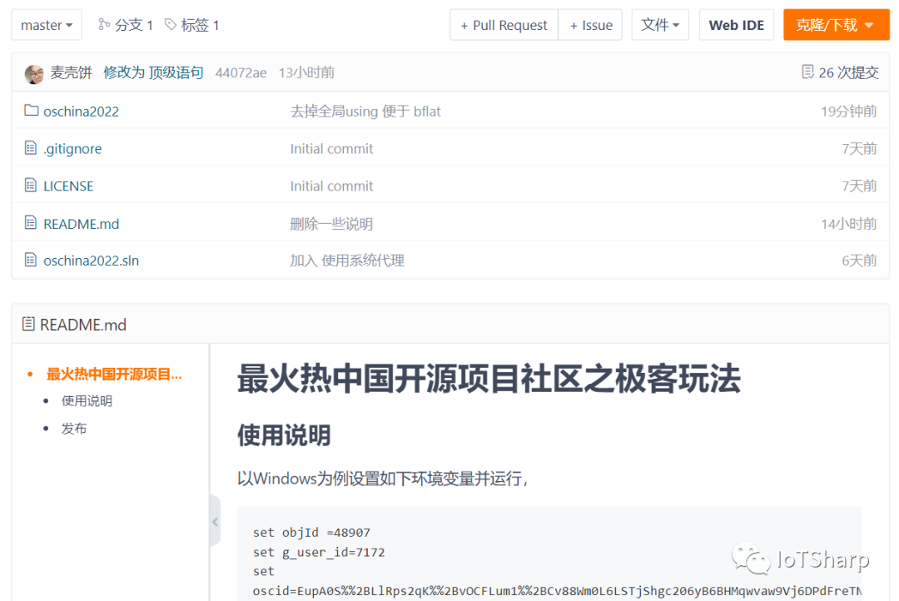
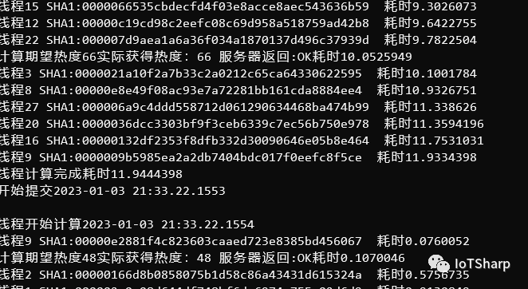

2022年度OSC中国开源项目奖

特别奖项：最具极客精神奖

经组委会讨论决定，2022 年度 OSC 中国开源项目评选「最具极客精神奖」获奖者是开源项目 IoTSharp 创始人 **麦壳饼**。

今年的年度 OSC 中国开源项目评选新策划了**「最火热中国开源项目社区」**奖项，并且增加了全新的 “极客” 玩法。在此背景下，开发者纷纷施展才华，积极为开源项目贡献 **“热度值”**。

其中，IoTSharp 项目的作者 @麦壳饼 在了解活动玩法后，很快就用 .NET (C#) 实现了分别支持 Win 64 和 Linux x64 的脚本。

不仅如此，在评选活动进行期间他更是直接将贡献热度的工具开源了出来：**https://gitee.com/maikebing/oschina2022**，并在后续积极优化代码。

热爱开源，无私分享，追求极致，这正是 “极客精神” 的真实写照。