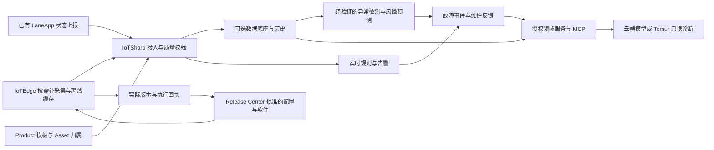

# IoTSharp 设备监测与预测运维定位及实施规划

日期：2026-09-05。本文是当前代码、历史路线和公开竞品资料的阶段性评估，也是收费现场试点的实施依据。任务顺序在 [ROADMAP](../../ROADMAP.md) 跟踪，前端拆解在 [界面路线图](../design/iotsharp-ui-redesign-roadmap.md) 跟踪。

## 1. 已确认的业务方向

用户已确认：主攻设备状态检测、监测、AI 和预测；高速公路收费系统作为首个验证现场；设备状态已经对接并可上报至内网 IoTSharp 实例。**当前起点是已有状态接入后的数据核验和业务建模，不是从零开发设备接入。**

建议定位：**面向存量设备和分布式现场、支持内网部署的设备状态监测与预测运维平台。** 首个行业包服务高速公路收费站的机电与信息设备，以发现故障、判断影响、辅助诊断和验证维护效果为主要价值。平台核心保持行业中立，收费站的设备分类、状态映射、故障知识和页面视图通过模板及适配器承载。

采购和使用者的合理假设是收费运营单位、机电运维团队和系统集成商；尚未确认付费主体、预算、交付人数及商业模式。不能把这个假设写成已获得客户的结论。

已知与待证实事项分开记录：

| 事项 | 当前判断 | 下一证据 |
| --- | --- | --- |
| 收费设备状态已接入 | 用户明确确认 | 按设备类型抽样核对字段、时间和状态更新 |
| 内网实例可访问 | 本次 GET 首页为 HTTP 200；用户登录后完成只读抽样，版本显示 3.5.0.0 | 部署版本与源码提交仍需单独对照 |
| Product/Asset/Device 业务归属 | 当前设备列表 2,809 条，Product 列表已有 LaneApp 1 条，Asset 列表 0 条 | 复用已有产品和站/车道属性，补现场归属与能力语义 |
| Gateway/EdgeNode 受管生命周期 | 当前 EdgeNode 列表 0 条；状态上报不能证明这一项 | 注册、连续心跳、能力、任务和诊断回执 |
| 配置收敛、灰度和回滚 | 未取得现场证据 | 执行进程的实际版本、配置哈希和回滚后采集结果 |
| 历史故障及维修标签 | 尚未确认 | 故障起止、原因、维护动作和恢复记录 |

本轮不修改现网配置，不部署最新源码，不控制收费设备，也不将未核验的生产里程碑标记完成。

### 登录后只读抽样结果

本次现场检查在当前账号、当前筛选范围进行，不是全设备盘点。保留汇总事实和字段名，排除真实凭据、连接地址及设备身份值。

| 观察 | 证据与含义 | 对下一工作的影响 |
| --- | --- | --- |
| 首页和列表相互矛盾 | 首页在线 0、Product 0；设备首屏 20 条中 15 条显示在线，产品页实际有 1 条 LaneApp | 先修复统计和范围/缓存回退，不能宣称 2,809 台全部离线，也不能据首页判断没有 Product |
| 已有业务元数据 | 第一台样本的属性接口返回 50 项，含 areaNo、sectionId、stationId、plazaId/plazaName、laneId/laneNo、roadName，以及设备/驱动配置 | 从已有数据形成 Asset 映射草稿；不用重新发明站/车道编码 |
| Device 首先是 LaneApp 实例 | 产品描述为高速公路车道软件，设备属性同时包含多个外设的连接/驱动信息 | 不能把当前 2,809 条 Device 直接称为 2,809 台独立栏杆机/天线；先确认运行实例与外设身份 |
| 状态存在过期与语义冲突 | 第一台样本页面显示在线，但 Active=false；Connected、LastConnectDateTime 在 8 月 28 日，LastActivityDateTime 在 8 月 25 日 | 分开连接、活跃、新鲜度和外设功能状态；不据旧标记判断今天健康 |
| 最新遥测未显示 | 两台抽样的最新遥测页均为空；第一台接口 HTTP 200、业务码成功、data=[] | 只证明这两台此接口无最新值，不证明所有设备无历史。核验源状态、事件路由、持久化及查询投影 |
| 消息数不等于健康观测数 | 首次首页最近 24 小时消息 72,262，后续截图 73,039 | 计数在增长，但不能推导全部设备持续上报或预测数据完整 |
| 查询合同出现失败 | 告警列表 400：ClearDateTime 无法转为 DateTime[]；规则事件 400：RuleId 无法转为 nullable Guid；空列表另报 pageSize=0 | 先修现有查询和错误状态，不能把“请求失败”展示为“无告警” |
| 属性中混入凭据 | 发现含认证信息的 RTSP 连接配置被普通属性页直接显示 | 凭据应改为受管引用；API/导出/日志/AI 上下文同时治理，不能仅做前端遮挡 |

在线统计的代码依据是 `CachingExtension.GetKanBanCacheAsync` 直接沿用 fallback.OnlineDeviceCount，未执行在线计数；列表则使用 `connected`。Product 数量差异的具体查询/缓存原因尚未定位，不与在线统计问题混为同一个已确认根因。[C11]

抽样覆盖首页、设备列表、两台设备详情、属性/最新遥测、Product、Asset、EdgeNode，以及页面自然发起的查询响应。未读取全部历史、未做写入探测、未触发诊断/发布任务。截图位于本地 `output/playwright/strategy-20260905/`，账号显示已遮挡；含原始属性内容的临时浏览器记录不作为交付物保留。

## 2. 代码同步与评估边界

| 仓库 | 本次基线 | 同步结果 |
| --- | --- | --- |
| IoTSharp | `master` / `ae5a8626` | 已 fetch，与 GitHub 默认分支 `origin/master` 一致 |
| Data.JsonDB 子模块 | `38c0ff1d` | 与 `origin/main` 一致 |
| SonnetDB 子模块 | `e642063b` -> `e46f158e` | 快进 72 个提交；主仓库留下可审查的 gitlink 更新 |
| SonnetDB 内 CoAP 子模块 | `797a8599` | 已 fetch，与 `origin/master` 一致 |
| SonnetDB 内 MQTT Routing 子模块 | `9e0c8202` | 已 fetch，与 `origin/master` 一致 |
| IoTEdge 独立仓库 | 本机 `c824a55`，远端 `9a29103` | `D:\GitHub\IoTEdge` 干净但领先远端 4 个提交；本次只 fetch/读取，保留未推送成果 |

IoTEdge 不在本项目 `.gitmodules` 中。主仓库另有 `origin/main` 的独立 MQTT/迁移修改，不能把默认分支更新解释为合并所有分支；本次没有合并它，也没有推送任何仓库。

范围覆盖：主解决方案、领域及跨仓契约、接入/规则/发布关键实现、存储适配、测试及 CI、前端代表页面、IoTEdge 本地最新实现和组织相关仓库的公开文档。它不是全仓逐行安全审计，也不是所有 provider、硬件与固件的完整运行验收。

Tomur、IoTEmbedded、IoTCoWork 的现状来自当日读取的公开 README/路线图；未做完整源码构建和硬件验证。GitHub 组织清单只覆盖本次返回的公开仓库；私有 SaaS 仓库及其他组织项目不能从名称推导实现程度。

## 3. 过往积累与路线修正

Git 历史含 2018 年初始提交；2020 年已有管理端布局和健康检查；2022 年文档项目进入历史；2023 年持续演进 Docker、MQTT、Jint 和 NSwag。2026 年 7 月集中完成领域更名、Edge 契约、采集配置、发布中心及 SonnetDB 集成；8 月又完成控制台外壳和启动恢复体验改造。[C1]

这些历史说明已经形成可复用的平台资产：接入协议、租户和身份、Product/Device/Asset、实时规则、数据适配、边缘管理和发布合同。应在现有 ASP.NET Core/.NET 10、Vue 3、Element Plus、Fast Crud 上逐层改造。NSwag、RulesEngine、Jint 和原有数据库 provider 按现有边界保留。

需要调整的是投入重点和完成口径：

1. 从“平台拥有多少功能”转为“哪些设备问题可以发现、解释并闭环”。
2. 从“不断补新底座”转为“固定可复现组合并完成现场验证”。
3. 从“AI 可以聊天”转为“建议有依据、预测有回测、维护后可验证”。
4. 从“平台 API 已实现”转为分别核验 API、UI、执行端、真实现场四个层次。

旧路线将“全栈零外部依赖”称为独有优势，证据不足。SonnetDB 能降低某些部署组合的服务数量，但 native 库、模型权重、操作系统及运维依赖仍然存在；其他厂商也提供边缘和离线能力。宜对外使用“可内网部署、组件可选、交付可控”，以实测安装、恢复和维护成本证明优势。

## 4. 当前能力与关键缺口

| 领域 | 已有资产 | 本轮核实的缺口与影响 |
| --- | --- | --- |
| 领域建模 | Product、Device、Asset 与 semantic-core-v1 已存在 | 现场产品能力、站/车道归属、责任和故障语义仍需对照现有数据，不能重新制造平行设备目录 |
| 设备健康 | 状态、遥测、属性、告警及趋势入口 | 现网统计/列表状态不一致，抽样 latest 为空；通用 `TelemetryDataDto` 只有键、时间、类型和值，质量、到达时间与过期口径需沿全链路核验 [C2][C11] |
| 发布中心 | Packages、Plans、Start/Confirm/Pause/Resume/Rollback、任务、回执和审计 API | 当前菜单“运维与发布”主要提供 Edge 任务和设备告警，源码中未找到独立完整的 Release Center 前端工作流 [C3] |
| 边缘软件更新 | 下载、SHA256 校验、本地 release store、指针切换 | 没有负责实际进程切换的 supervisor 闭环；回执成功不能证明新程序已运行 [C4] |
| 设备 OTA | 平台已定义脚本/固件任务与回执校验 | 本次 IoTEdge task switch 和 capability 只声明 ConfigPush、HealthProbe、SoftwareUpdate，不能把平台 OTA 合同等同于该边缘执行端已支持 [C4] |
| 跨仓契约 | `IoTSharp.Contracts` 有 DTO、Schema 和样例 | IoTEdge 仍有本地 collection contract DTO，项目文件未引用正式合同包；边缘 SonnetDB 包仍为 1.2.0，需要消费侧兼容验证 [C5] |
| 离线采集 | 配置快照、失败恢复、上传缓存和续传 | 缓存选项有批量和周期，未见总字节/最长保留时间预算；增加磁盘满、去重、过期数据和续传挤占的验证 [C6] |
| AI/MCP | AISettings 和少量设备只读工具 | `GetDeviceAttribute` 调用授权查询后改用全表 `_context.Device` 按名称查找，存在跨租户属性读取风险，必须先修复并回归 [C7] |
| 工程交付 | 多 profile 集成测试、集中包管理、容器部署 | 主 CI 仍使用不存在的 `IoTSharp.sln` 和旧 JsonDB 项目路径，checkout 未开启递归子模块；不能把本机构建通过当作干净 checkout 可交付 [C8] |
| 前端交付 | 统一外壳、12 主题、领域导航、工作区组件 | 通用消息总线/平台健康首页不满足收费运维首屏；说明性文案和大概览挤占业务信息，Edge 字段仍大量使用原始英文 [C9] |
| SonnetDB | 多模型、时序、EF、缓存、MQ、对象、检索已有实现 | 最新自有审计仍指出 nightly、容量、恢复与工作流验收缺口；多表 DML 补偿不等于跨表掉电原子性 [C10] |

MCP 风险是代码级发现，未在生产跨租户执行探测。此次任务只将修复及必要回归纳入最高优先级，不顺手改写现网安全逻辑。

## 5. 竞品与可竞争的位置

比较基于 2026-09-05 可读取的厂商官方页面和项目公开仓库。厂商声明不等于本次实测；不同版本/商业版的覆盖和报价须采购前单独核实。没有用 stars、协议数量或厂商宣传吞吐判定产品优劣。

| 对照对象 | 官方可确认的能力 | 对 IoTSharp 的启示 | 本阶段选择 |
| --- | --- | --- | --- |
| ThingsBoard + Edge [W1] | 本地数据处理、断网运行，管理设备、看板、规则和 OTA | 通用 IoT 控制台与 Edge 已是成熟竞争区 | 保留现有平台能力，优先做好收费设备的故障语义、诊断和维护闭环 |
| EMQX Neuron，原 NeuronEX [W2] | 工业协议采集、本地处理、缓存、多云上传、UNS/Sparkplug 相关能力 | 协议插件的现场兼容和数据质量比协议清单更有价值 | IoTEdge 可独立和第三方平台协作；先覆盖实际收费设备，避免无需求扩协议 |
| JetLinks [W3] | 多协议、设备管理、规则引擎、菜单/按钮/数据权限，公开社区版与商业服务 | 中国集成商已经能取得通用物联网基础平台 | 在可复用行业模型、内网运维和 .NET 扩展便利性上形成可交付方案 |
| AWS IoT SiteWise [W4] | 工业资产模型、层级、指标、边缘采集处理及监测 | “资产上下文 + 设备数据 + 指标”比裸点位列表更贴近运维 | 复用现有 Asset 与 Product，补齐现场上下文和可追溯健康指标 |
| IBM Maximo [W5] | 维护、巡检、可靠性、资产绩效及 AI 辅助维护 | 预测价值最终要落到维护动作和停机减少 | 对接现有工单系统，先做轻量事件/维护结果关联，再决定是否扩展工单域 |

Node-RED 的节点配置和调试体验仍可作为 M6 的局部参考，不能据此把 RuleChain 扩成收费业务或长期运维流程引擎。

核心差异化假设应当是“懂设备和现场的监测产品”：同一站点网络异常不会被解释为几十台独立设备损坏；一台设备风险上升能追溯到异常趋势、同类设备对照和最近维护。收费行业试点若无法证明减少重复告警或缩短排障时间，这个定位仍需要调整。

## 6. 收费现场的最小业务模型

采用现有状态接入作为数据源，先建立映射与追溯，不要求替换现有收费业务程序。

当前先保留 LaneApp Product 与其 Device 实例，再映射已有站点/车道元数据。外设健康可先作为带 `componentKey` 的观测关联该来源实例；只有外设具备稳定身份和独立生命周期需求时，才定义子设备及其 Product。不能为了画设备树重复创建设备，也不能从现有连接配置推断外设已持续提供健康指标。本轮未读取或修改 LaneApp 源码工作区。

| 概念 | 现场映射建议 | 约束 |
| --- | --- | --- |
| Product | 某型号/能力类别的栏杆机、天线、工控机、摄像机、UPS 模板 | 示例设备是否在首批范围，需现场清单确认；模板包含状态枚举、指标单位、故障规则和采样默认值 |
| Device | 一个真实接入实例 | 稳定 ID，与原系统标识对应；保留真实上报通道 |
| Asset | 路段、收费站、车道或承担业务功能的设施对象 | 层级放在 Asset；物理设备需要维护档案时可关联设施 Asset，避免自动复制整套 Device 树 |
| Gateway | 汇聚并转发子设备状态的南向访问角色 | 现有车道软件/状态汇聚程序是否属于此角色要按行为判断 |
| EdgeNode | 受管的观测/采集运行时 | 独立登记身份、版本、心跳、能力；设备能上报不能自动证明存在受管 EdgeNode |
| Collection Template | 现有状态字段到标准点位的映射和采集政策 | Product/模板库所有；发布时生成不可变版本 |

健康维度必须拆开：连接状态、数据新鲜度、设备功能状态、维护状态。至少表达正常、异常、未知/数据过期、维护中；不能把“不再上报”显示为正常，也不能把行政关闭车道直接算作设备故障。

建议形成 `health-observation-v1` 扩展合同，复用 semantic-core 点位 ID 与单位，包含源时间、接收时间、来源设备/采集器、质量、状态码、原值、映射版本和适用时序。先通过新 DTO/适配器兼容旧上报，明确未知质量默认值，避免强行改变现有 payload。

候选监测内容：

| 设备类别 | 可先利用的信号 | 条件成熟后才引入 |
| --- | --- | --- |
| 工控机/采集服务 | 进程、心跳、CPU/内存、磁盘、端口、异常日志 | 有正常负载基线后的资源耗尽预测 |
| ETC 天线及相关读写设备 | 在线、自检、超时、错误计数 | 有交易尝试分母和原因分类后的失败率异常；业务失败不能直接认定天线坏 |
| 栏杆机 | 状态、报警、动作请求与到位反馈 | 有传感器与厂家接口后研究动作耗时、电流、循环次数与劣化 |
| 摄像机 | 在线、视频流可用性、自检 | 有合规样本及标注后研究遮挡、画面冻结等质量监测 |
| UPS/交换机 | 状态、供电、电池/端口指标、设备告警 | 有对应历史与工况后研究电池衰减、链路风险 |

这些是模板候选，不能假定现场已经具备全部信号。只有离散在线/离线状态时，先做断连、抖动、异常持续时长与站点关联；这类数据通常不足以预测机械剩余寿命。

## 7. 前端应成为运维工作台

保留现有视觉品牌、12 主题、Vue/Element Plus 和已投入的图形组件。下一轮设计以 Operate 工作模式为主，评价标准是找到问题、理解证据和完成处置的效率。

建议保留原有三个技术层及平台治理导航，并增加基于角色的工作入口。现场运维默认进入“设备健康”；实施人员进入建模/采集；平台管理员仍可进入现有消息总线和服务健康页。

| 页面 | 主要内容与布局 | 首要动作 |
| --- | --- | --- |
| 设备健康 | 顶部站点/车道/时间范围；左侧 Asset 树；中央异常设备表和车道状态矩阵；右侧选中设备证据 | 定位影响范围并进入诊断 |
| 设备诊断 | 稳定设备身份、所属 Product/Asset、数据新鲜度；趋势与告警/配置/维修统一时间线 | 核对异常依据、记录结果或关联工单 |
| 故障事件 | 事件分组、严重性、影响设备/车道、首次/末次发生、负责人、处置状态 | 确认、分派、维护抑制、补充根因和恢复证据 |
| Product/采集工作区 | 状态字典、单位、质量政策、映射样本、校验结果、版本差异 | 将已有状态映射成模板，审核并生成版本 |
| Edge 运维 | 本地/平台配置来源、目标/当前版本、进程实际版本、缓存积压、失败点和诊断 | 查询及授权后的受控部署 |
| 发布中心 | 包、目标展开、兼容检查、批次、观察窗口、审批、回执和回滚进度 | 预览目标、批准、暂停或回滚 |
| AI 诊断侧栏 | 当前对象与时间范围、证据引用、工具调用记录、结论与不确定性 | 生成解释或建议，由人员判断后续动作 |

设计改造要点：

1. 复用 `ConsolePageShell`、`ConsoleCrudWorkspace`、`ConsoleDrawerWorkspace`，减少重复的介绍、概览和说明卡；业务数据区使用实色表面。
2. 列表保留筛选、排序和滚动上下文；重要设备/事件提供稳定 URL，支持跨人员分享，复杂诊断不长期藏在多层抽屉中。
3. `Target/Current/Hash/Receipt` 转为业务中文，完整标识、JSON 与原始诊断放在可展开的高级视图；开发标识仍可复制。
4. 首屏呈现异常、未知数据、影响车道、持续时间和责任人，不把消息总量当作设备运维成果；所有汇总显示数据时间和统计范围。
5. 维护窗口、数据过期、离线缓存、无权限、部分失败、空数据和断线重连必须有明确状态；状态同时用文字和语义色表达。
6. 桌面优先支持高密度表格、固定列和列选择，移动端面向查看、确认和现场反馈；大型配置图保留桌面完整体验。
7. 图表按时间窗口聚合、限制点数、按需加载；暂停自动刷新时保持当前证据；3D 和大屏进入后续 Asset View，不作为值班人员的首要交互。

验收选择真实任务：找到最近一次异常设备、定位同站共因、核对数据过期、比较配置版本、追溯维修前后变化。记录完成时长、错误操作与上下文丢失；界面截图通过不等于运维任务通过。

## 8. 边缘端与自有生态的投入边界

| 仓库/组件 | 在本定位中的责任 | 下一步 | 投入原则 |
| --- | --- | --- | --- |
| IoTSharp | 业务控制面、健康模型、事件与维护关联、规则、权限、审计及发布 | 建模、数据质量、监测工作台、跨租户隔离、现场证据 | 主投入 |
| IoTEdge | 状态采集/适配、现场诊断、离线缓存和任务执行 | 固定本机 4 个提交的交付基线、正式合同消费、缓存配额、实际升级执行器 | 与试点共同优先 |
| IoTSharp.Contracts | 云边/SDK 合同的唯一权威定义 | JSON 样例双向回归、版本协商、能力声明、兼容矩阵 | 平台和执行端共同验收 |
| SonnetDB | 可选时序/业务/消息/对象与检索数据底座 | 先验证真实使用路径、恢复边界和部署组合；通用存储修复归 SonnetDB | 不把九模型全量能力变为 IoTSharp 的交付前提 |
| Data.JsonDB | JSON 上的 SQL/ADO.NET 辅助能力 | 固定版本和必要回归 | 不作为设备生产时序主库，也不重复扩成另一个综合数据库 |
| MQTT Routing / CoAP | 已有接入协议与路由基础 | 保留能力，明确嵌套子模块和包发布来源 | 不为监测试点重写协议栈 |
| IoTSharp.Data.Taos、IoTDB/Taos HealthChecks、SDK | 已有时序/健康/设备接入适配 | 以直接 PackageReference 和项目引用为依据维护消费矩阵 | 不因自有底座而删除现有可用 provider |
| IoTEmbedded | MCU 级传感采集及脚本生命周期 | 当现场缺少状态接口时，才增加必要传感器及板级验证 | 现有状态已经能上报，不强行更换收费设备固件 |
| Tomur | 可选的站级/中心级离线推理 provider | 验证目标模型、硬件、超时、工具调用、资源和实际 API 兼容 | 不把模型推理与收费采集放在同一资源争用链路 |
| IoTCoWork / NativeWebHost / Client | 本地联调及实施工具候选 | 复用语义/合同，以插件连接平台 | 不另造平台权限、资产主数据和发布事实来源 |
| Couplet、RustSharp、SonnetArt 等 | 各自独立工具/技术产品 | 按其自身路线发展 | 未发现当前主平台直接依赖时，不纳入监测试点必做事项 |

Tomur 的旧“无测试、仅雏形”描述已过时：当前公开 README 包含 managed/native 双路径、测试项目及 Agent Framework 接线，同时明确最新升级仍待验证、`strict=true` 不受支持等边界。[W6] 平台本身尚没有由此自动获得模型 provider、预测服务或完整 AI 诊断能力。

IoTEmbedded 的公开路线仍列出资源/硬件验证和低资源 Linux 的待办。[W7] IoTCoWork 的公开说明涉及商业上层，但本次没有该私有仓库的实现证据，不能把它列为已交付能力。[W8]

跨仓发布至少记录：仓库提交、包版本、镜像 digest、Schema/合同版本、数据库格式/迁移版本、硬件/OS、模型和采样配置、构建与现场证据。**源码最新与生产批准版本分别管理。** SonnetDB 的本次更新不能直接替换现网镜像。

## 9. AI 与预测的递进路径

AI 诊断和时序预测是两条相互配合的能力：LLM 适合解释、知识检索、汇总及建议；数值风险预测需要特征、标签、时间切分和可复现模型。优先采用成熟统计/ML 库，不在 IoTSharp 中自研推理引擎。

| 阶段 | 输入和输出 | 门槛 |
| --- | --- | --- |
| A0 数据可用 | 状态字典、源时间/接收时间、质量、新鲜度、映射版本 | 来源可追溯；缺失/未知不能当正常 |
| A1 规则健康 | 持续离线、错误频率、资源阈值、维护抑制、站点共因提示 | 用现有规则能力建立可解释基线，逐项验证告警；M6 引擎增强仍等 O4 |
| A2 只读诊断助手 | 经授权获取状态/趋势/告警、说明书及维护记录，输出引用证据的建议 | 修复 MCP 隔离，按设备 ID 和时间范围授权；有审计、超时、预算及失败回退 |
| A3 异常检测 | 按设备类型、工况和站点建立基线，生成异常分数 | 回测时间外/站点外数据；按事件评估误报，先影子运行 |
| A4 故障风险预测 | 明确“未来 H 小时/天内某种故障”，输出风险、适用范围与证据 | 足够故障/维修标签，排除标签泄漏，超越规则/统计基线，确认可操作提前量 |
| A5 条件维护 | 预测关联维护建议，人员确认后记录处置和效果 | 观察到净收益才推广；剩余寿命预测还需退化及失效/删失样本 |

预测验收必须记录：故障定义、预测窗口、训练/验证区间、设备/站点拆分、告警合并和去重规则、基线模型、样本数及区间不确定性。不能随机拆分相邻遥测点后宣称泛化能力，也不能用“准确率高”掩盖故障稀少造成的偏差。

首批指标采用每设备日误报、事件级 precision/recall、有效提前量、误报处理耗时、故障诊断时长与维护后恢复情况。阈值由现场基线确定。无足够故障样本时，只发布“异常检测/风险提示”，不宣传“预测故障准确率”或“剩余寿命”。

AI 通过 `Microsoft.Extensions.AI` 类 provider 抽象和版本化 MCP 访问授权领域服务；需要编排时按项目约定评估最新稳定 Microsoft Agent Framework。具体版本及 Tomur 兼容能力在实现时验证，不能只凭兼容 API 名称推断全部工具/结构化输出支持。远程重启、写设备、发布和回滚保留平台权限、精确操作确认和审计。

## 10. 执行步骤与时间窗口

保持 O1 -> O2 -> O3 -> O4 -> O5 的现场门槛。监测数据已接入，可在 O1 使用已有状态和规则做观察、核验与映射；不以此跳过受管运行时、配置和发布证明。

下面是资源与现场条件具备时的建议窗口，不是确定工期。团队和维护窗口未知，以门槛完成时间重新排程；站点和设备数先由现场批准。

| 窗口 | 工作及编号 | 交付/通过条件 |
| --- | --- | --- |
| 第 1-2 周 | #100-#106 交付/权限/现网正确性；#110 O1 现有状态与业务归属核验 | 干净 checkout 构建测试；隔离、统计与查询回归；现场映射及样本评审 |
| 第 2-4 周 | #111 数据质量；#112 监测工作台；#120-#121 O2 边缘诊断和可靠性 | 真实设备新鲜度可见，现场问题可定位；真实运行时连续心跳和诊断回执 |
| 第 4-6 周 | #130 O3 配置版本；#140-#141 O4 发布及真实执行器 | 已批准配置收敛；先对观测运行时受控 canary，实际进程版本确认和回滚后采集恢复 |
| 第 6-9 周，O4 后 | #150 M6 最小 trace/版本/失败定位；#151 事件与维护关联 | 一次真实事件从发现、诊断到维护结果闭环；规则失败能回看 |
| 第 8-12 周，按数据门槛 | #160 只读诊断；#161-#162 健康基线及异常检测影子运行 | 引用证据、工具审计；量化误报与诊断收益，不自动控制设备 |
| 3-6 个月 | #163 有标签故障预测；#170 第二现场复制 | 独立时间/站点验证、可操作提前量、交付成本及使用效果证据 |
| 6-12 个月，试点证明后 | #171 相邻行业复制、条件维护和必要规模能力 | 可复用模板适配第二类设施；由实际容量/可用性指标驱动 HA 和容量改造 |

人员少时保持一条主线；具备独立负责人时，平台/前端、边缘接入和数据分析可以围绕同一现场证据协作。不能默认同时推进 MCU、多模型数据库、桌面工作台和多模态 AI 的全栈开发。

首轮 backlog 的具体要求：

- #100：修复 CI 的 slnx/JsonDB 路径和 recursive checkout；构建、合同测试、业务 profile、前端构建各自报告；绑定产物提交。
- #101：修复 MCP 越权查询；按 ID 查询、分页、无对象行为、跨租户/同名设备测试；新增诊断工具共用权限和审计服务。
- #102：确认 IoTEdge 本地 4 个提交的交付归属，形成可获取的版本及跨仓矩阵；不以未推送代码作他人可以复现的基线。
- #103：核验 SonnetDB 当前使用的 EF/时序/MQ/备份路径；保留原部署回退能力，记录多表和跨模型恢复限制。
- #104：统一在线/活跃/过期口径、统计范围和缓存降级提示；首页不能用 fallback 0 推导全体离线。
- #105：修复告警/规则事件参数类型与空页 pageSize，恢复真实查询证据；查询失败不能等同于无数据。
- #106：把连接凭据移出普通设备属性，治理 API、导出、日志和 AI 上下文；评估已有暴露范围并安排受控轮换。
- #110：盘点已有设备、状态来源及样本，确认 Product/Asset 归属、状态枚举、负责人和维护口径。
- #111：统一源时间/接收时间、质量、新鲜度、乱序与重放策略；建立无上报、上报失败、设备故障三者的可区分状态。
- #112：提供设备健康及诊断首屏，避免继续把平台服务健康作为收费值班主屏。
- #120/#121：真实 runtime 状态/能力与诊断；配置来源优先级；有界缓存、重连、限流、磁盘满、进程恢复与积压告警。
- #130：基于现有状态映射生成批准模板/不可变版本，验证目标与实际版本、哈希和执行结果。
- #140/#141：发布中心页面与权限/确认工作流；实际 supervisor/服务/容器切换及启动失败恢复；未支持任务按 capability 拒绝。
- #150/#151：O4 后补最小规则证据，再将告警关联为故障事件和维护结果；对接现有工单，避免另造完整 EAM。
- #160-#163：分离只读 AI 诊断、健康政策、异常检测与预测的验收，按真实数据逐级开放。

## 11. 现场与产品验收

| 维度 | 记录方式 | 承诺边界 |
| --- | --- | --- |
| 数据质量 | 有效上报数/预期上报数、缺失率、重复率、源到达延迟 P95、过期时长；按周期/事件型分别统计 | 数字由现场采样建立，不预设已达到 99.9% |
| 诊断效果 | 相同故障类型的诊断时长、重复告警数、误报处置时间及维护结果 | 区分系统提示与人员确认根因 |
| 运行可靠性 | 目标配置/程序版本、断网缓存、重连续传、重启恢复、CPU/RSS/磁盘和失败回执 | 健康进程不代表采集正确；本地恢复不代表云边一致 |
| 发布结果 | 批次、批准、实际运行版本、前后采集、失败/回滚证据 | 下载/指针切换和运行成功分别呈现 |
| 预测效果 | 事件级误报/漏报、提前量、阈值与样本规模，独立时间/站点验证 | 样本不足时保持影子/实验状态 |
| 产品化 | 新站部署人时、模板复用率、首次有效监测耗时、运维反馈及付费验证 | 用户价值先于功能计数 |

容量估算从设备数 N、每设备点数 P、采样间隔 T 入手：常规点速率约为 `N * P / T`；事件型另计。断网空间按“峰值速率 * 消息实测字节 * 离线窗口 + 索引/日志开销”预算，规定满额策略。沿平台接入、事件总线、规则、存储和查询完整测量，不能拿 SonnetDB 内核写入基准代替平台 SLA。

第一条 O4 发布建议针对独立观测/采集运行时，在批准维护窗口和指定目标执行。收费交易、栏杆动作和车道控制保留现有业务系统职责；是否允许这些设备的实际远程动作需另行确定操作范围。

## 12. 商业与后续物联网方向

近期将交付包装为“收费站设备监测包”：状态适配、行业模板、健康工作台、诊断知识、现场部署与验收报告。经营指标围绕停机发现、排障效率、重复告警和复制成本，而非承诺替代收费系统。

中期可评估按站点/受管边缘节点提供交付与维护服务，按高级诊断/行业模板提供增值能力；开放核心、模板版权、服务与 SaaS 商业边界必须由负责人确认。本次不改变任何仓库许可证，也不假定公开项目中的商业方案已经存在。

未来适合延展的方向是相近的分布式设施监测，如收费周边机电、供配电和环境设施；先证明模板和诊断能跨站点复用，再进入相邻行业。UNS/Sparkplug、OPC UA、边缘轻量模型、设备健康图谱和条件维护都可以保留，但必须对应明确集成需求和数据条件。新硬件平台、完整数字孪生、通用低代码、消费级智能家居和大模型底座研发不占用首个监测试点的主投入。

## 13. 待补输入

需要继续补齐实际设备分类/型号、状态样本与接口、历史覆盖、故障与维修记录、允许的运维窗口、试点负责人和开发带宽。已经明确的方向和已有状态接入不重复确认。登录现网后的只读核验可把本报告的待证实项更新为证据；字段映射、真实现场验收与预测效果均不能凭本报告直接标记完成。

## 14. 本次验证记录

- 主仓库及所有已登记的嵌套子模块均检查 remote、工作区和提交差异；SonnetDB 已更新，其他已在目标分支最新。
- 使用 .NET SDK 10.0.400，执行主项目 Release 构建，带 `--no-restore --disable-build-servers -m:1 -p:UseSharedCompilation=false -p:GeneratePackageOnBuild=false`：0 错误、30 警告，用时约 2 分 56 秒。使用现有 NuGet 还原资产；不等同于干净环境 restore、完整集成测试或全部 SonnetDB 路径验证。
- `EdgeContractSerializationTests`、`SemanticCoreContractTests`、`SonnetDbMigrationTests` 定向测试 36 项通过、0 失败、0 跳过；未跑完整业务/容器/硬件矩阵。
- 内网登录后只读覆盖范围见第 1 节。真实浏览器查看 1440x1000 桌面和 390x844 移动首页；移动端文档宽度 390，无页面级横向溢出，但首屏仍主要被摘要及消息图占据，不足以完成现场诊断任务。没有部署或修改现网。

## 15. 证据索引

### 代码和已有路线

- [C1] 主仓库 Git 历史：2018 初始 `a41f0cec` / `7185fc24`，2020 前端 `403003e5`，2022 文档 `a9b2ece3`；2026 领域 `71e8b03b`、合同 `9fdae7ef`、发布 `a2697a6a`、界面 `1096bb1b`。另见 [现有路线](../../ROADMAP.md)。
- [C2] [TelemetryDataDto](../../IoTSharp.Contracts/TelemetryDataDto.cs)、[语义收敛](../docs/architecture/semantic-core-convergence.md)、[Asset 模型](../../IoTSharp.Data/Asset.cs)。
- [C3] [ReleaseCenterController](../../IoTSharp/Controllers/ReleaseCenterController.cs)、[菜单](../../IoTSharp/Controllers/MenuController.cs)、[ClientApp](../../ClientApp/src/views/iot)。
- [C4] 本机 `D:\GitHub\IoTEdge` 提交 `c824a55`：`src/IoTEdge/SoftwareUpdateExecutor.cs:133`、`EdgeRuntimeReportingWorker.cs:466` / `:823` 及 README 的软件更新边界。该提交尚未推送，不能以远端 master 链接代替其证据。
- [C5] 同一 IoTEdge 基线：`src/IoTEdge/GatewayCollectionConfigurationContracts.cs:80`、`src/IoTEdge/IoTEdge.csproj`、`Directory.Packages.props`；平台 [合同说明](../../IoTSharp.Contracts/README.md)。
- [C6] 同一 IoTEdge 基线：`src/IoTEdge.Infrastructure/Uploads/OfflineUploadBuffer.cs`、`OfflineUploadDrainWorker.cs`。
- [C7] [DeviceTool](../../IoTSharp/McpTools/DeviceTool.cs)，`GetDeviceAttribute` 方法；本次只静态核验。
- [C8] [主 CI](../../.github/workflows/dotnet-build.yml)、[前端 CI](../../.github/workflows/nodejsbuild.yml)、[解决方案](../../IoTSharp.slnx)、[测试路线](../../IoTSharp.Test/TEST_ROADMAP.md)。
- [C9] [运行概览](../../ClientApp/src/views/dashboard/index.vue)、[产品列表](../../ClientApp/src/views/iot/product/productlist.vue)、[Asset 详情](../../ClientApp/src/views/iot/assets/assetdetail.vue)、[Edge 详情](../../ClientApp/src/views/iot/edge/EdgeDetail.vue)、[现有设计](../../DESIGN.md)。前端结论主要来自源码和已有设计约束，不冒充全部页面的浏览器回归。
- [C10] [SonnetDB 九模型证据](../../SonnetDB/docs/audits/nine-model-capability-evidence-20260905.md)、[最新约束](../../SonnetDB/AGENTS.md)、[M41 生产收口边界](../../SonnetDB/docs/benchmarks/m41-production-closeout.md)、[平台兼容矩阵](../docs/operations/sonnetdb-compat-matrix.md)。
- [C11] [统计缓存](../../IoTSharp/Extensions/CachingExtension.cs)、[设备列表在线口径](../../ClientApp/src/views/iot/devices/deviceCrudOptions.ts)、[基础字段展示](../../ClientApp/src/views/iot/devices/detail/deviceDetailBaseInfoColumns.ts)；现网浏览器及页面查询只读证据见第 1 节。未在报告中保存设备凭据和身份值。

### 当日读取的公开资料

- [W1] [ThingsBoard Edge 官方文档](https://thingsboard.io/docs/edge/)。
- [W2] [EMQX Neuron 官方产品页](https://www.emqx.com/en/products/neuronex)，页面当前名称为 Neuron，注明原 NeuronEX。
- [W3] [JetLinks 社区仓库](https://github.com/jetlinks/jetlinks-community)，读取 master README；不由社区文档推断商业版全部能力。
- [W4] [AWS IoT SiteWise 官方概览](https://docs.aws.amazon.com/iot-sitewise/latest/userguide/what-is-sitewise.html)。
- [W5] [IBM Maximo 官方页面](https://www.ibm.com/products/maximo/monitor)，实际返回 Application Suite 概览。
- [W6] [Tomur](https://github.com/IoTSharp/Tomur)，读取 main README；测试数字及模型证据为该仓库声明，未在本任务复跑。
- [W7] [IoTEmbedded](https://github.com/IoTSharp/IoTEmbedded)，读取 main README 和 ROADMAP。
- [W8] [IoTCoWork](https://github.com/IoTSharp/IoTCoWork)，读取 main README。

部分 raw.githubusercontent.com 请求直连失败后使用本机代理读取；GitHub API 后续遇到限流，未据此推测缺失的 Release/私有仓库状态。ThingsBoard 预测维护猜测路径返回 404、ThingsGateway 站点连接失败，这些页面不作为比较证据。
